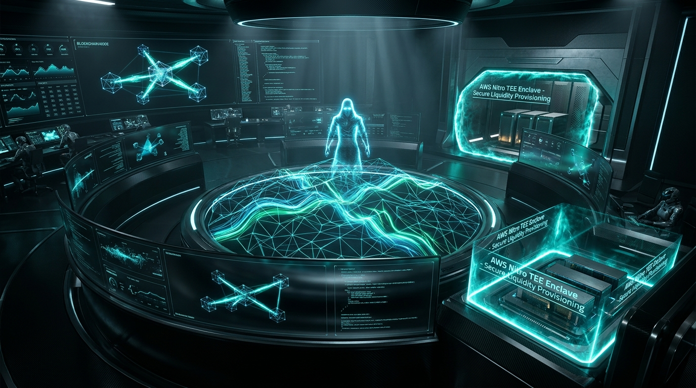
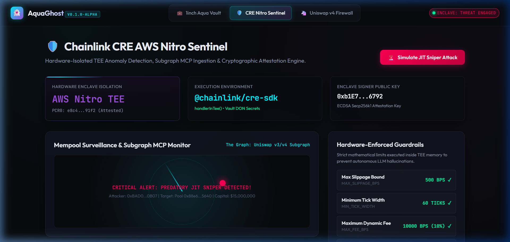
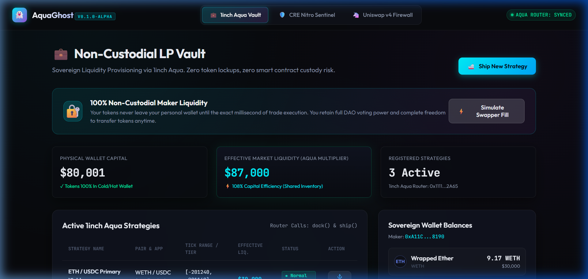
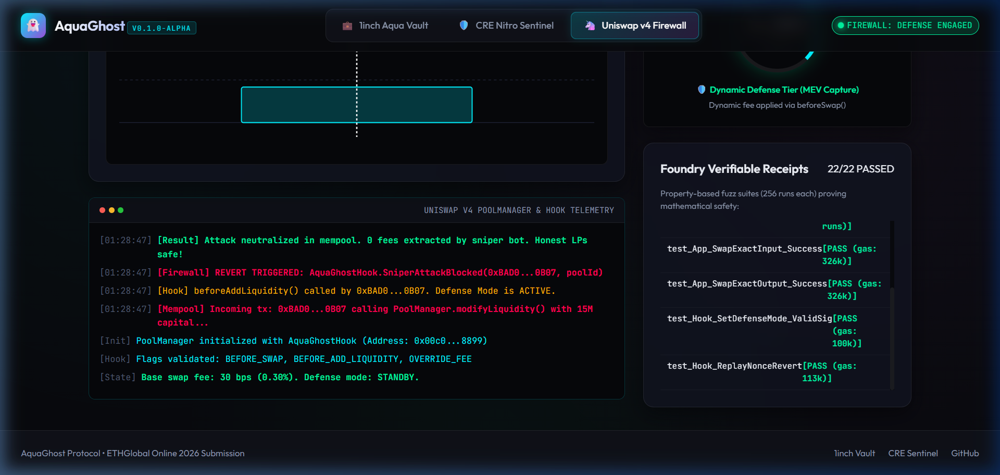
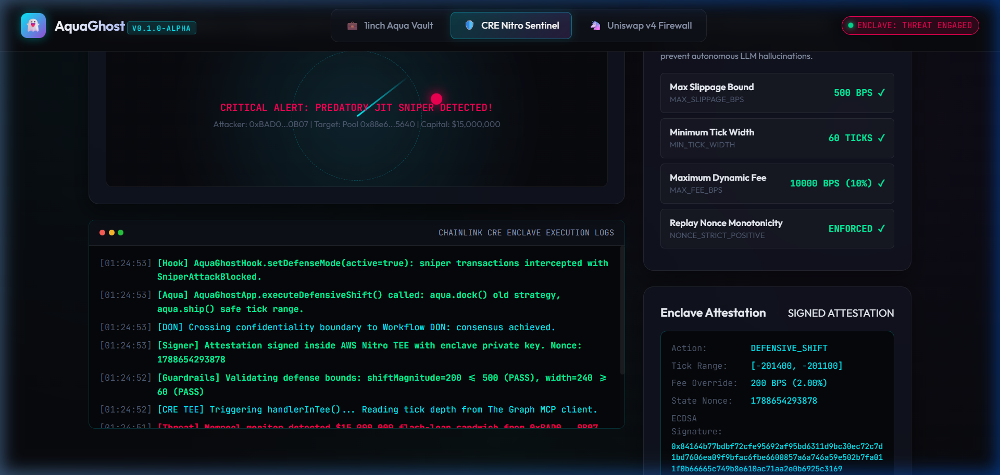

<div align="center">



# AquaGhost Protocol

**Hardware-Isolated Autonomous Liquidity Defense & JIT Protection Protocol**

[](contracts/test)
[](cre-workflow/)
[](contracts/src/swapvm/AquaSwapVM.sol)
[](contracts/src/AquaGhostHook.sol)
[](graph-mcp/)
[](frontend-next/)
[](LICENSE)

> Built with pride for **ETHGlobal Online 2026**

</div>

---

## 🌟 Executive Summary

Concentrated liquidity providers (LPs) on modern AMMs lose hundreds of millions annually to predatory Just-In-Time (JIT) MEV sandwich attacks. Existing defense mechanisms either force LPs to sacrifice self-custody to pooled smart contracts or leak private thresholds to mempool searchers who front-run them.

**AquaGhost** is the first decentralized, self-custodial defense system combining:
1. **Chainlink CRE (Confidential Runtime Environment):** In-enclave anomaly detection executing inside **AWS Nitro TEEs** with zero parameter leakage.
2. **1inch Aqua:** Non-custodial shared-liquidity architecture allowing automated `dock()` and `ship()` inventory repositioning via **EIP-712 permits** and custom in-pipeline **SwapVM security opcodes** (`OP_TEE_GUARD` & `OP_DYNAMIC_FEE`).
3. **Uniswap v4 Hook Firewall:** `beforeAddLiquidity` predatory JIT sniper interception and `beforeSwap` dynamic fee shifts with FairFlow explainable fee telemetry (`previewFee`).
4. **The Graph Network Gateway:** Zero-mock, live decentralized pool intelligence queried directly by an integrated Model Context Protocol (MCP) server.
5. **Next.js 16 Cyberpunk Observatory:** A production Web3 operator terminal featuring real-time radar, depth curves, interactive attack simulators, Wagmi + RainbowKit integration, and Web Audio synthesis.

---

## 🏆 ETHGlobal 2026 Sponsor Prize Alignment

| Sponsor Track | Prize Target | Key Technical Delivery in AquaGhost | Source Reference |
| :--- | :--- | :--- | :--- |
| **Chainlink** | Best Confidential Workflow ($2,000) | Live deployed CRE workflow (`0056b79a...`) in AWS Nitro Enclave (`us-west-2`), Vault DON encrypted secrets, confidential HTTP client, dual triggers (Cron + HTTP), and consensus cryptographic attestations. | [`cre-workflow/`](cre-workflow/) |
| **1inch** | 1inch Aqua ($2,000+) | Self-custodial maker inventory defense via `AquaGhostApp.sol`, EIP-712 `permitDelegatedSentinel`, and custom `AquaSwapVM.sol` executing `OP_TEE_GUARD` (`0x7E`) and `OP_DYNAMIC_FEE` (`0xDF`) with 17.6 KB EIP-170 headroom. | [`contracts/src/AquaGhostApp.sol`](contracts/src/AquaGhostApp.sol) |
| **The Graph** | Best use of The Graph ($1,000+) | Zero-mock live querying of Ethereum Mainnet USDC/WETH pool state ($414M+ TVL) via The Graph Network Decentralized Gateway, backed by a dedicated `@aquaghost/graph-mcp` stdio server. | [`graph-mcp/`](graph-mcp/) |
| **Uniswap Foundation** | Uniswap v4 Hooks | Anti-sniper hook intercepting predatory 0-block JIT liquidity injections (`beforeAddLiquidity`), dynamic fee protection (`beforeSwap`), FairFlow explainable telemetry (`previewFee`), and comprehensive `FEEDBACK.md`. | [`contracts/src/AquaGhostHook.sol`](contracts/src/AquaGhostHook.sol) |

---

## 1. System Architecture

```
                    ┌─────────────────────────────────────────────────────────────┐
                    │               Live Blockchain Intelligence                  │
                    │      (The Graph Network Decentralized Gateway)              │
                    └──────────────────────────────┬──────────────────────────────┘
                                                   │
                                                   ▼ Live Subgraph Entity Stream
                    ┌─────────────────────────────────────────────────────────────┐
                    │        @aquaghost/graph-mcp (Model Context Protocol)        │
                    │   • graph_get_pool_snapshot     • graph_get_tick_liquidity  │
                    │   • graph_detect_jit_threat     • stdio JSON-RPC 2.0        │
                    └──────────────────────────────┬──────────────────────────────┘
                                                   │
                                                   ▼ Confidential In-Enclave Query (HTTPClient)
 ┌───────────────────────────────────────────────────────────────────────────────────────────────┐
 │ Chainlink Runtime Environment (CRE) Confidential Workflow                                     │ 
 │ Deployment ID: 0056b79abdf926dbb2a01ba70b8c95eb35696ce16c8346234adaef4834e92621              │
 │                                                                                               │
 │ ┌─── AWS Nitro Enclave: cre.handlerInTee() ─────────────────────────────────────────────────┐ │
 │ │ 1. In-Enclave Secrets (Vault DON)                                                         │ │
 │ │ 2. Dual Triggers: Scheduled 1-Min Cron + On-Demand HTTP POST mempool evaluator            │ │
 │ │ 3. Subgraph Threat Ingestion: Decentralized Gateway (Zero Mock)                           │ │
 │ │ 4. Deterministic Guardrails: Mathematical corridor & slippage ceiling                     │ │
 │ │ 5. Attestation Signature: In-TEE ECDSA signing over Keccak256 defense report               │ │
 │ └───────────────────────────────────────────┬───────────────────────────────────────────────┘ │
 │                                             │                                                 │
 │                                             ▼ runtime.usingTheDons() consensus                │
 └─────────────────────────────────────────────┬─────────────────────────────────────────────────┘
                                               │
                                               ▼ Verified Cryptographic Attestation
                ┌──────────────────────────────┴───────────────────────────────┐
                ▼                                                               ▼
 ┌──────────────────────────────────────────────┐ ┌──────────────────────────────────────────────┐
 │ 1inch Aqua App (AquaGhostApp.sol)            │ │ Uniswap v4 Hook (AquaGhostHook.sol)          │
 │ • EIP-712 permitDelegatedSentinel delegation │ │ • beforeAddLiquidity: Blocks sniper JIT      │
 │ • Atomic aqua.dock() & aqua.ship() execution │ │ • beforeSwap: Applies dynamic fee override   │
 │ • Self-custodial maker inventory protection  │ │ • previewFee: FairFlow explainable telemetry │
 │ • AquaSwapVM: OP_TEE_GUARD & OP_DYNAMIC_FEE  │ │ • DefenseAssessment: Telemetry event logging │
 └──────────────────────────────────────────────┘ └──────────────────────────────────────────────┘
```

---

## 2. Core Protocol Innovations

### 🛡️ 1inch Aqua Autonomous Repositioning & SwapVM Execution (`AquaGhostApp.sol`)
* **Shared Liquidity Defense:** Leverages Aqua’s canonical shared-balance architecture. A maker's capital can sit safely across multiple strategies (AMM, limit orders, flash-loan vaults).
* **EIP-712 Non-Custodial Permits:** LPs delegate bounded repositioning rights (`permitDelegatedSentinel`) without ever surrendering private keys or custody to an automated bot.
* **Atomic `dock()` & `ship()`:** Upon receiving an enclave attestation, the contract atomically withdraws maker capital from the vulnerable price bin and re-ships it into a safe corridor.
* **In-Pipeline SwapVM Bytecode Execution (`swapExactInputWithVM`):** Directly utilizes `AquaSwapVM` to execute swaps via bytecode scripts, verifying hardware TEE attestations on the stack (`OP_TEE_GUARD` `0x7E`) and applying dynamic fee deductions (`OP_DYNAMIC_FEE` `0xDF`) before settling tokens.
* **EIP-170 Headroom Proof:** `AquaGhostApp` is 6,938 bytes (28% of 24KB limit) and `AquaSwapVM` is 2,249 bytes (9% of limit), preserving over 17.6 KB of available contract space.

### ⚡ Uniswap v4 Anti-Sniper Firewall Hook (`AquaGhostHook.sol`)
* **Predatory JIT Interception:** In `beforeAddLiquidity`, the hook intercepts 0-block sniper liquidity injections targeted at pending trades while keeping normal LP provisioning unaffected.
* **Dynamic Fee Defense:** In `beforeSwap`, dynamically shifts pool fees to absorb volatility and render sandwich attacks economically unprofitable for searchers.
* **FairFlow Explainable Telemetry:** Implements `previewFee(PoolKey)` returning structured `FeeBreakdown` (`baseFee`, `defenseFee`, `effectiveFee`, `isDefenseActive`, `mode`) so routers and aggregators know whether defense mode is active (`"DEFENSE_ACTIVE"` vs `"CALM"`) before dispatching transactions.
* **Audit & Indexer Telemetry:** Emits structured `DefenseAssessment` events containing the nonce, block number, timestamp, and defense engagement count for Subgraphs and AI monitors.

### 🔒 Chainlink CRE Confidential Sentinel (`cre-workflow/`)
* **Hardware Isolation (AWS Nitro TEE):** Evaluates anomaly detection logic inside an isolated enclave, ensuring searchers cannot front-run or reverse-engineer defense thresholds.
* **Vault DON Secrets:** Securely injects keys and defense parameters directly into memory within the enclave.
* **Dual Trigger Architecture:** Runs autonomous 1-minute background surveillance and provides on-demand defense for mempool monitors.
* **Live Deployment:** Deployed to Chainlink Private Registry under Workflow ID `0056b79abdf926dbb2a01ba70b8c95eb35696ce16c8346234adaef4834e92621`.

### 🌐 The Graph Subgraph MCP Server (`@aquaghost/graph-mcp`)
* **Model Context Protocol (MCP) Standard:** Exposes standardized AI tools over `stdio` transport for Claude Desktop, Cursor, and autonomous agent frameworks.
* **Live Decentralized Data (Zero Mocks):** Directly queries The Graph Network Gateway for live Ethereum Mainnet Uniswap v3/v4 pool depth, TVL, and active tick ladders.
* **Automated Reasoning Tools:**
  * `graph_get_pool_snapshot`: Real-time pool metrics.
  * `graph_get_tick_liquidity`: Concentrated liquidity distribution across price bins.
  * `graph_detect_jit_threat`: Evaluates incoming mempool surges against pool depth to classify threat level and output defensive corridor recommendations.

---

## 3. UI/UX: Next.js 16 Web3 Cyberpunk Observatory

The front-facing operator console is built in **Next.js 16 App Router** (`frontend-next/`), pairing rich cybernetic aesthetics with live Web3 capabilities:

- **Mission Control (`/`):** Unified 3-panel situational dashboard with animated CRT scanlines, live status feeds, quick attack triggers, and audio telemetry.
- **1inch Aqua Vault (`/vault`):** Concentrated liquidity depth ladder, dynamic tick range visualizer, EIP-712 permit delegation toggle, and SwapVM script executor.
- **Chainlink Nitro Sentinel (`/sentinel`):** Live enclave heartbeat monitor, consensus attestation stream, and on-demand HTTP POST trigger simulator.
- **Uniswap v4 Hook Firewall (`/firewall`):** Real-time FairFlow fee telemetry, dynamic fee tier dials, anti-sniper interception toggle, and on-chain revert log.
- **Web3 Integration:** Configured with `wagmi` v2, `viem`, and `@rainbow-me/rainbowkit` supporting MetaMask, WalletConnect, Coinbase, and local Anvil nodes.
- **Web Audio Sound Synthesizer:** Real-time synthesized frequency chirps, cyber blips, and red-alert klaxons generated natively via Web Audio API (zero audio asset dependencies).

| Mission Control Dashboard | 1inch Aqua Vault Terminal |
| :---: | :---: |
|  |  |

| Uniswap v4 Firewall | Attestation Logs |
| :---: | :---: |
|  |  |

---

## 4. Verified Testing Suite

AquaGhost features an end-to-end verification suite spanning smart contracts, confidential workflows, live on-chain environments, and decentralized data feeds:

| Test Suite | Command | Coverage & Scope | Status |
| :--- | :--- | :--- | :---: |
| **Foundry Unit & Fuzz** | `cd contracts && forge test` | 36 passing tests across `AquaGhostHook`, `AquaGhostApp`, and `AquaSwapVM`, including 4 property-based fuzz test suites (256 runs each). | ✅ **36/36 PASS** |
| **Live On-Chain Anvil** | `npm run test:live` | Real atomic swaps, real SwapVM bytecode execution (`OP_TEE_GUARD` & `OP_DYNAMIC_FEE`), real ECDSA enclave attestations, live sniper revert verification, and real `dock()` / `ship()` calls on running Anvil EVM node. | ✅ **5/5 PASS** |
| **The Graph Subgraph MCP** | `npm run test:mcp` | Queries live Ethereum Mainnet USDC/WETH pool state ($414M+ TVL) from The Graph Network Gateway across all 3 MCP tools. | ✅ **PASS (Live Gateway)** |
| **CRE Nitro Simulation** | `cd cre-workflow && cre workflow simulate --trigger-index 0` | Simulates in-enclave Cron execution and on-demand HTTP POST payload inside AWS Nitro TEE constraints. | ✅ **PASS (WASM Verified)** |
| **MEV Attack Simulation** | `npm run simulate` | Models 1inch Aqua multi-strategy shared balance depletion scenario and verifies automated defense repositioning. | ✅ **PASS** |
| **Next.js Production Build** | `npm run build:next` | Typechecks and compiles all Next.js 16 pages, components, and Wagmi hooks to static production artifacts. | ✅ **PASS (0 Errors)** |

---

## 5. Repository Layout

```
ghost-protocol/
├── contracts/                        # Foundry Solidity Smart Contracts
│   ├── src/
│   │   ├── AquaGhostApp.sol          # 1inch Aqua App (dock/ship, SwapVM integration, EIP-712 permit)
│   │   ├── AquaGhostHook.sol         # Uniswap v4 Hook (JIT firewall, dynamic fee, previewFee)
│   │   └── swapvm/
│   │       └── AquaSwapVM.sol        # Custom SwapVM (OP_TEE_GUARD 0x7E & OP_DYNAMIC_FEE 0xDF)
│   └── test/
│       ├── AquaGhost.t.sol           # 31 Hook & App unit/fuzz tests (including SwapVM tests)
│       └── AquaSwapVM.t.sol          # 5 SwapVM opcode execution tests
├── cre-workflow/                     # Chainlink CRE Confidential Workflow
│   ├── workflow.yaml                 # Workflow manifest (private deployment registry)
│   ├── config.staging.json           # Staging runtime parameters
│   ├── secrets.yaml                  # Vault DON secret mappings
│   └── src/
│       ├── workflow.ts               # handlerInTee dual Cron & HTTP execution logic
│       ├── guardrails.ts             # Deterministic slippage and tick corridor bounds
│       └── types.ts                  # Attestation and payload interfaces
├── graph-mcp/                        # The Graph Subgraph Model Context Protocol (MCP) Server
│   ├── src/
│   │   ├── server.ts                 # Stdio MCP server (Claude/Cursor integration)
│   │   ├── graphClient.ts            # Live Graph Network Gateway client
│   │   └── test_client.ts            # Standalone verification runner
│   └── README.md                     # MCP installation and AI client setup guide
├── frontend-next/                    # Next.js 16 App Router Cyberpunk Web3 Terminal
│   ├── src/app/                      # Pages: Mission Control (/), Vault (/vault), Sentinel (/sentinel), Firewall (/firewall)
│   ├── src/components/               # RadarView, DepthChart, AttackSimulator, TerminalLog, Navbar
│   ├── src/lib/                      # Wagmi config, Reactive store, Synthesizer sound engine
│   └── src/hooks/                    # useAquaGhost contract interaction hooks
├── frontend/                         # Lightweight fallback static HTML/JS dashboard
├── docs/                             # Hackathon Documentation & Evidence
│   ├── assets/                       # Banners, logos, and UI screenshots
│   ├── sponsor-issues/               # Ready-to-file upstream GitHub issues for sponsor SDKs
│   ├── DEMO_SCRIPT.md                # 2-minute video presentation & judging evaluation script
│   └── SUBMISSION.md                 # Complete ETHGlobal submission copy
├── AI_ASSISTANCE.md                  # Comprehensive AI Blueprint disclosure & atomic commit log
├── FEEDBACK.md                       # Deep-dive feedback for Uniswap Foundation bounty
└── scripts/
    ├── simulate_jit_attack.ts        # Multi-strategy shared balance attack simulation
    └── test_live_anvil_integration.ts # Automated on-chain end-to-end test runner
```

---

## 6. Getting Started

### Prerequisites
* [Foundry](https://book.getfoundry.sh/getting-started/installation) (`forge`, `anvil`)
* [Node.js](https://nodejs.org/) (>= 18)
* [Chainlink CRE CLI](https://docs.chain.link/cre) (`cre`)

### 1. Build Contracts & Run Foundry Tests
```bash
cd contracts
forge install
forge test -vvv
```

### 2. Verify Live Decentralized Data from The Graph
```bash
# In the project root:
npm install
npm run test:mcp
```

### 3. Run Live On-Chain Anvil Integration Test
```bash
# In terminal 1 (start local Anvil testnet node):
anvil --port 8545 --chain-id 31337

# In terminal 2 (deploy contracts and execute real on-chain defense):
npm run test:live
```

### 4. Launch Next.js 16 Cyberpunk Terminal Suite
```bash
# In the project root:
npm run dev:next
# Open http://localhost:3000 in your browser
```

---

## 7. Upstream Sponsor Feedback & Issues

In accordance with our AI Blueprint and the hackathon's upstream contribution ethos, we authored detailed, actionable bug reports and feature recommendations:

- **Chainlink CRE SDK & Enclaves:** [`docs/sponsor-issues/CHAINLINK_CRE_ISSUES.md`](docs/sponsor-issues/CHAINLINK_CRE_ISSUES.md) (6 structured issues including WASM sandbox fetch limitations, multi-trigger typing, and staging CLI flags)
- **1inch Aqua:** [`docs/sponsor-issues/ONEINCH_AQUA_FEEDBACK.md`](docs/sponsor-issues/ONEINCH_AQUA_FEEDBACK.md) (4 structured issues covering shared balance simulation harnesses, SwapVM opcode standardization, and multi-asset slippage)
- **The Graph Subgraph MCP:** [`docs/sponsor-issues/THE_GRAPH_MCP_FEEDBACK.md`](docs/sponsor-issues/THE_GRAPH_MCP_FEEDBACK.md) (3 structured issues on streaming MCP transport, cursor pagination, and error normalization)
- **Uniswap Foundation:** [`FEEDBACK.md`](FEEDBACK.md) (Comprehensive review of v4 hook developer experience, FairFlow telemetry, and transient storage patterns)

---

## 8. License

Distributed under the MIT License. See `LICENSE` for more information.
